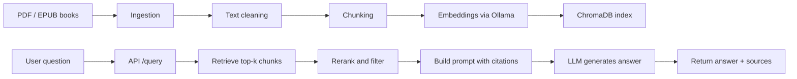

# Phase 0 Overview

This file explains the scaffold we built before Phase 1. The goal is to make the repo easy to understand, easy to extend, and easy to talk through in an interview.

## What Phase 0 Gives Us

- A clear Python project structure
- Centralized config and logging
- Shared data models for documents and chunks
- A FastAPI app with a health endpoint
- Docker support for the app and Ollama
- A place for tests and future documentation

## File And Folder Purpose

- `pyproject.toml`: Python project metadata, dependencies, and tooling config
- `requirements.txt`: pip-installable dependency list
- `.env.example`: template for local environment variables
- `docker-compose.yml`: runs Ollama and the app together
- `Dockerfile.app`: builds the Python app container
- `README.md`: quick project summary and setup notes
- `DESIGN.md`: architecture trade-offs and honest scope notes
- `docs/phase0_overview.md`: this explanation file
- `app/`: main application package
- `app/main.py`: FastAPI entrypoint
- `app/api/`: HTTP routes and request/response schemas
- `app/core/`: config, logging, and shared domain models
- `app/ingest/`: PDF/EPUB extraction will live here
- `app/chunking/`: chunking strategies will live here
- `app/embeddings/`: Ollama embedding client will live here
- `app/index/`: ChromaDB storage and indexing will live here
- `app/retrieval/`: similarity search and reranking will live here
- `app/generation/`: prompt assembly and answer generation will live here
- `app/eval/`: evaluation dataset and metrics will live here
- `app/ui/`: Streamlit UI will live here
- `tests/`: automated tests

## End-To-End Data Flow

## Why This Structure

- Ingestion is isolated so extraction rules can improve without affecting retrieval logic.
- Chunking is isolated so we can compare strategies without rewriting the rest of the app.
- Retrieval, generation, and evaluation are separate so we can measure each layer independently.
- Shared models in `app/core/models.py` keep metadata consistent across the pipeline.

## What Is Not Built Yet

- PDF parsing and EPUB parsing
- Chunking logic
- Embedding generation
- ChromaDB indexing
- Retrieval and reranking
- Prompting and grounded generation
- Evaluation metrics
- UI

## Honest Scope Note

Phase 0 is intentionally small. It is a scaffold, not a finished RAG system. The important thing is that every later layer has a clean place to live.

