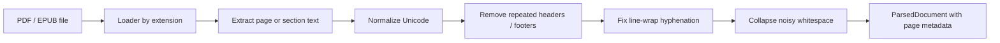

# Phase 1 Overview

Phase 1 adds the document ingestion layer that turns raw books into structured page text ready for chunking.

## What We Built

- PDF loading with `pypdf`
- EPUB loading with `ebooklib` and `BeautifulSoup`
- Text cleaning and normalization
- Repeated header/footer removal
- Hyphenation repair across line breaks
- A single parser entrypoint that routes by file extension

## Ingestion Flow

## Why This Matters

RAG quality depends heavily on the quality of extracted text. If page headers, footers, page numbers, or broken line wraps stay in the text, they pollute chunks and hurt retrieval later.

## Important Simplification

This is a best-effort text extraction pipeline, not a full layout-aware OCR system. For many digital PDFs and EPUBs, it will work well enough to start. For difficult scanned or multi-column books, we may need stronger parsing later.

## Storage Paths

For this project, the source books live in:

- `/Users/macbook/Documents/GenAI/Projects/Data/pdf_data`

Later, the ChromaDB persistence directory will be:

- `/Users/macbook/Documents/GenAI/Projects/Data/DBs/chroma`
