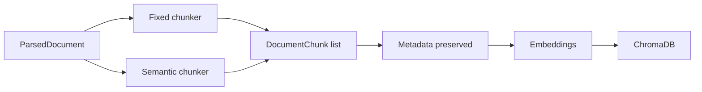

# Phase 2 Overview

Phase 2 adds chunking, which turns cleaned page text into retrieval-friendly units for embedding and search.

## What We Built

- Fixed-size chunking with overlap
- Structure-aware chunking based on heading-like lines
- Chunk metadata propagation
- Stable chunk IDs derived from document ID and chunk text

## Chunking Flow

## Why Two Strategies

- Fixed chunking is predictable and easy to evaluate.
- Semantic chunking can keep headings and sections together, which often improves retrieval quality on book-like material.
- Having both lets us compare recall and answer quality later instead of guessing.

## Honest Simplification

The semantic chunker is heuristic-based, not a full document layout parser. It looks for heading-like lines and groups surrounding text accordingly. That is good enough for a first production-style RAG scaffold, but a more advanced system could use dedicated layout models or PDF structure extraction.

