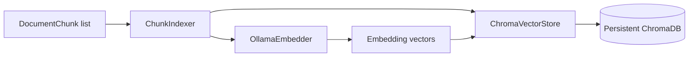

# Phase 3 Overview

Phase 3 connects chunks to a persistent vector index. Each chunk is sent to Ollama's embedding endpoint, then stored in ChromaDB with its original text and metadata.

## Flow

## Incremental Indexing

The indexer processes chunks in batches. Chroma's `upsert` uses the stable chunk ID created in Phase 2, so adding a new book only adds its IDs and re-indexing an existing book updates matching IDs. No full collection rebuild is needed.

## Design Choices

- Ollama is accessed through a small HTTP client so the request and response format remain visible for learning.
- Chroma owns persistence and similarity-index details; the rest of the application depends on the small `ChromaVectorStore` boundary.
- Metadata values are normalized to Chroma-supported scalar types. Missing values are omitted rather than stored as `null`.
- Embeddings are batched to reduce HTTP overhead and make memory use predictable.

## Honest Simplification

This phase does not yet add a job queue, retry policy, embedding cache, model-version migration, or multi-user access control. A production deployment would need those concerns, especially when indexing large libraries or changing embedding models. The collection is also local and single-process, which is appropriate for this learning project but not a hosted production scale target.
