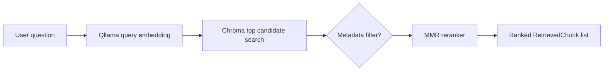

# Phase 4 Overview

Phase 4 turns the vector index into a retrieval component. A question is embedded with the same Ollama embedding model used during indexing, Chroma returns a candidate set, and MMR reranking selects the final top-k chunks.

## Retrieval Flow



## Why MMR

Pure similarity search can return several overlapping chunks from the same passage. Maximal Marginal Relevance balances query relevance with similarity to already-selected results, which increases coverage of different parts of an answer. The `diversity` parameter controls this balance: `0` favors relevance, while larger values penalize redundancy more strongly.

The retriever asks Chroma for `k * 3` candidates by default, then reranks down to `k`. This gives the reranker enough alternatives without loading the whole collection.

## Metadata Filtering

The `where` argument is passed to Chroma, so callers can restrict retrieval to a book or other indexed metadata. For example:

```python
retriever.retrieve(
    "Explain self-attention",
    k=5,
    where={"book_title": "Hands-On Machine Learning"},
)
```

## Honest Simplification

MMR is a lightweight diversity reranker, not a learned cross-encoder. A production system might compare cross-encoder quality, hybrid keyword plus vector retrieval, query rewriting, and separate indexes by embedding-model version. Those are useful future experiments, but MMR keeps the retrieval mechanics understandable and dependency-light for this project.
