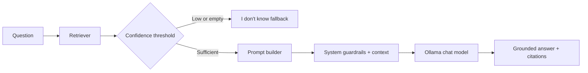

# Phase 5 Overview

Phase 5 completes the core RAG loop. Retrieved chunks are formatted as numbered context, injected into an Ollama chat prompt, and returned with source/page citations.

## Generation Flow

## Prompt Contract

The system prompt instructs the model to use only the supplied context, avoid invented details, and cite factual claims with markers such as `[1]`. The user prompt contains the question plus each retrieved chunk and its source/page label.

This explicit context injection is what makes the application RAG. Retrieval alone would only return matching chunks; here those chunks flow into the generation prompt and influence the answer.

## Confidence Fallback

Before calling the LLM, the generator checks the highest retrieval score. If no chunks are returned or the score is below `min_retrieval_score` (default `0.35`), it returns a grounded “I don't know” response. The threshold is a tunable heuristic, not a calibrated probability, and should be measured during evaluation.

## Honest Simplification

The application asks the model to cite sources but does not yet independently verify that every citation marker is valid or that every claim is entailed by its cited text. Phase 6 will add evaluation, including retrieval recall and answer faithfulness checks. Production systems may add citation parsing, claim-level verification, streaming, prompt-injection defenses, and model-specific safety controls.
