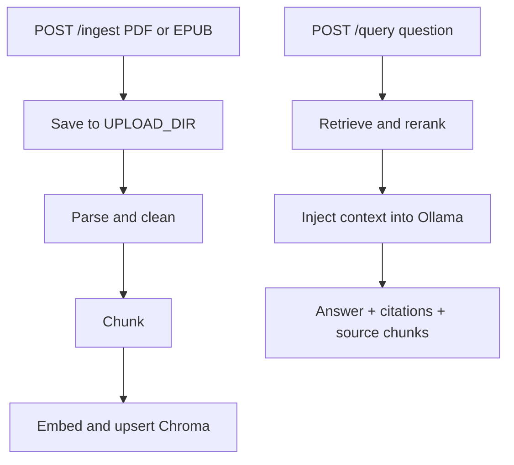

# Phase 7 Overview

Phase 7 exposes the RAG pipeline through FastAPI.

## API Flow

## Endpoints

- `GET /health`: lightweight application health response.
- `POST /ingest`: multipart upload with `file` and optional `strategy` (`fixed` or `semantic`).
- `POST /query`: JSON body with `question`, optional `k`, and optional `book_title` filter.

The query response includes the generated answer, grounded flag, confidence, citations, and retrieved source chunks so the UI can show evidence rather than only the final text.

## Honest Simplification

The service is currently a single-process composition with synchronous indexing and generation. A production deployment would use background jobs for large uploads, authentication and authorization, upload size limits, content scanning, request IDs, rate limiting, streaming responses, and stronger readiness checks for Ollama and Chroma. The upload route also overwrites a same-named file; production storage should use content-addressed or unique object keys.
