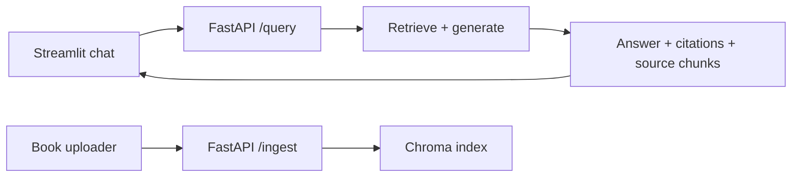

# Phase 8 Overview

Phase 8 adds a simple Streamlit interface for portfolio demonstrations. It calls the FastAPI backend rather than importing the RAG internals, which mirrors how a separate web frontend would interact with the application.

## UI Flow



The UI exposes the API URL, top-k setting, optional book filter, upload control, and chunking strategy. Each assistant response shows whether it was grounded, its retrieval confidence, and an expandable list of retrieved source chunks.

## Running

With Docker Compose, start the API and UI together:

```bash
docker compose up --build
```

Open `http://localhost:8501`. For local development, run:

```bash
streamlit run app/ui/streamlit_app.py
```

## Honest Simplification

This is intentionally a demonstration UI, not a production frontend. It has no authentication, multi-user session isolation, upload progress, streaming token responses, persistent conversation storage, or frontend observability. A React client could later reuse the same API contract without changing the retrieval or generation layers.
